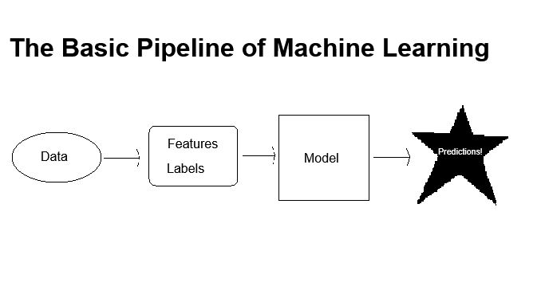

## Machine Learning

The basic pipeline of machine learning works as follows:
Bring in data, and preform data analysis in order to sort it into useful features. Labels are applied to designate which sets of data belongs to which group, often as a boolean. This is then used by the model of your choice to make predictions.

Many different models exist, such as xgboost, random forest, and linear regression. What model you want to use depends on what you want to get out of that model. For example, linear regression models are best suited when predicting regressions, while random forest and xgboost are better for classifiers.

Models use parameters to turn data into predictions. Essentially, parameters are the constants in the equation, while the features are the variables. The model can either be black box or open box, which refers to the transparency of the operations the model preforms.

The predictions can be either classification or regressions. Classifying models predict labels for future data, whereas regression models predicts a continuous value. 